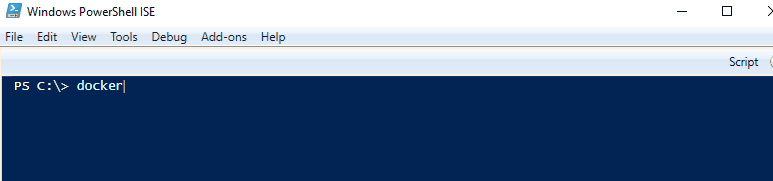

# DockerCompletion for PowerShell



* Many completions (probably much more than you imagine :smiley:)
* Automatic detection of aliases [like `d`](#i-use-alias-d-for-docker-does-the-completion-work-for-the-alias) and others
* Wild card (`*`) support
* [Customizable](#customization)
* Contributions welcome!

## Requirements
* PowerShell >= 5.0
* docker cli >= 1.13 in `$env:PATH`

### Optional
* [Compose v2](https://github.com/docker/compose)

  It is used for `docker compose` completion.
  The supported version will be bumped up frequently.
  For information about it, see the comment of [Compose/completers.ps1](DockerCompletion/Compose/completers.ps1).

## Installation

```powershell
# Install from PowerShell Gallery
Install-Module DockerCompletion -Scope CurrentUser
# Import
Import-Module DockerCompletion
```

Don't forget to execute the `Import-Module` command every time you start a new PowerShell session. You can do it automatically [by using PowerShell profile](#how-can-i-execute-import-module-automatically).

### Other methods

<details>
<summary>Git</summary>

```powershell
# Shallow clone from GitHub
git clone --depth 1 https://github.com/matt9ucci/DockerCompletion
# Import
Import-Module ./DockerCompletion/DockerCompletion
```

</details>

<details>
<summary>As a "well-formed" module</summary>

DockerCompletion is a "well-formed" module.
You can install and import it in the usual manner as follows.

#### Install

Download and place the [DockerCompletion directory and files](./DockerCompletion) in `$env:PSModulePath`.

You can see the paths listed in `$env:PSModulePath` as follows:
```powershell
PS C:\> $env:PSModulePath -split ';'
C:\Users\matt9ucci\Documents\WindowsPowerShell\Modules
C:\Program Files\WindowsPowerShell\Modules
C:\WINDOWS\system32\WindowsPowerShell\v1.0\Modules
```

If your target path is `C:\Users\matt9ucci\Documents\WindowsPowerShell\Modules`, execute the following commands:

```powershell
# Uninstall previous version
Remove-Item $HOME\Documents\WindowsPowerShell\Modules\DockerCompletion\ -Recurse -Force
# Download
Invoke-WebRequest https://github.com/matt9ucci/DockerCompletion/archive/master.zip -OutFile master.zip
# Unzip the downloaded archive
Expand-Archive master.zip
# Place the unzipped files and directory in $env:PSModulePath
Move-Item master\DockerCompletion-master\DockerCompletion\ "$HOME\Documents\WindowsPowerShell\Modules\"
# Clean up
Remove-Item master.zip
Remove-Item master -Recurse -Force
```

`$HOME` is a PowerShell's automatic variable containing the full path of the user's home directory (in this case `C:\Users\matt9ucci`).

#### Import

Execute the following command to check if you can import DockerCompletion:

```powershell
PS C:\> Get-Module -ListAvailable DockerCompletion

    Directory: C:\Users\matt9ucci\Documents\WindowsPowerShell\Modules

ModuleType Version    Name                                ExportedCommands
---------- -------    ----                                ----------------
Manifest   1.2010.... DockerCompletion
```

After the check, execute the following command to import the installed module:

```powershell
Import-Module DockerCompletion
```

</details>

## Customization

You can add your own completers and modify default completers with your custom script.

For information about how to write custom scripts, see [completers.ps1](DockerCompletion/completers.ps1) and [completers4arguments.ps1](DockerCompletion/completers4arguments.ps1)

To apply your custom script, pass the path as `Import-Module`'s ArgumentList parameter:
```powershell
Import-Module DockerCompletion -ArgumentList pathto\custom1.ps1, pathto\custom2.ps1
```

## Known Issues
In PowerShell 5.0/5.1, with one dash (`-`) and double dash (`--`), completers are not invoked because of [a PowerShell's bug](https://github.com/PowerShell/PowerShell/issues/2912).
It will be [fixed in PowerShell 6.0](https://github.com/PowerShell/PowerShell/pull/3633).

A workaround for this issue is to type a character following `-` and `--`.
For example, type `--a` and press tab.

## FAQ

### How can I execute `Import-Module` automatically?

Use [PowerShell profile](https://docs.microsoft.com/en-us/powershell/module/microsoft.powershell.core/about/about_profiles).
For example, run the following commands:

```powershell
# Create your profile
New-Item $PROFILE -ItemType File -Force
# Add the import command to the profile
Add-Content $PROFILE 'Import-Module DockerCompletion'
```

Whenever you start a new PowerShell session, the commands in the `$PROFILE` are executed each time.

### I use alias `d` for `docker`. Does the completion work for the alias?

Yes, it does. DockerCompletion detects aliases for `docker` when executing `Import-Module`.
For example:

```powershell
# Set the alias `d` for `docker`
Set-Alias d docker
# Detect the alias `d` and register completers for both `docker` and `d`
Import-Module DockerCompletion
```

## Misc

This github repository will be often rebased.

## Links

* [PowerShell Gallery | DockerCompletion](https://www.powershellgallery.com/packages/DockerCompletion)
* [docker/cli](https://github.com/docker/cli)
